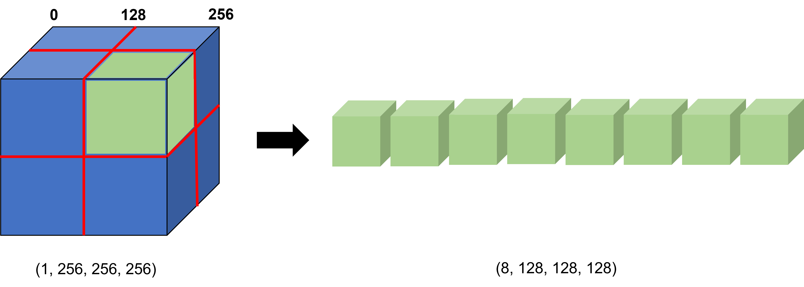

딥러닝 "3D 패치 학습" 사용 방법
 ====================
 # 1. 패치 학습이란?
  본 프로젝트는 비디오 메모리가 작은 GPU에서도 큰 용량의 __3D__ 데이터들을 패치로 분할하여 학습 할 수 있는 방식을 제안한다.
 
 > 3차원 영상은 영상의 데이터가 크기 떄문에 그래픽카드(GPU) 메모리의 한계로 인하여 보통 학습을 진행하는데 어려움을 겪게 된다. 패치 학습을 사용하게 되면, 각 이미지의 크기가 줄어들어, 적은 메모리를 가진 하드웨어로도 한 번에 여러 개를 한 번에 학습하는 효과가 있어, 학습이 안정화되고 가속화되는 장점을 얻을 수 있다.
 > > 데이터를 여러 개로 쪼갠 패치(patch)를 학습데이터로 사용하는데, __지역적인 특성(local feature)을 학습하는 방법이기에, 전체적인 특성(global feature)__ 을 학습해야하는 데이터에는 적절치 못한다.

# 2. 패치 코드
2.1 패치 조각 만들기 (get patches)
``` python
def get_patches(img_arr, size=128, stride=128):
    patched_list = []
    overlapping = 0
    if stride != size:
        overlapping = (size // stride) - 1
    if img_arr.ndim == 3:
        i_max = img_arr.shape[0] // stride - overlapping
        for i in range(i_max):
            for j in range(i_max):
                for k in range(i_max):
                    patched_list.append(img_arr[i * stride: i * stride + size, j * stride: j * stride + size,
                                        k * stride: k * stride + size, ])
    else:
        raise ValueError("img_arr.ndim must be equal 4")
    return np.stack(patched_list)
```

2.2 패치 조각 합치기 (reconstruct patches)
``` python
def reconstruct_patch(img_arr, org_img_size, stride=128, size=128):
    if type(org_img_size) is not tuple:
        raise ValueError("org_image_size must be a tuple")
    if size is None:
        size = img_arr.shape[2]
    if stride is None:
        stride = size
    nm_layers = img_arr.shape[4]
    i_max = (org_img_size[0] // stride ) + 1 - (size // stride)
    j_max = (org_img_size[1] // stride ) + 1 - (size // stride)
    k_max = (org_img_size[2] // stride ) + 1 - (size // stride)
    total_nm_images = img_arr.shape[0] // (i_max ** 3)
    images_list = []
    kk=0
    for img_count in range(total_nm_images):
        img_bg = np.zeros((org_img_size[0],org_img_size[1],org_img_size[2],nm_layers), dtype=img_arr[0].dtype)
        for i in range(i_max):
            for j in range(j_max):
                for k in range(k_max):
                    for layer in range(nm_layers):
                        img_bg[
                        i * stride: i * stride + size,
                        j * stride: j * stride + size,
                        k * stride: k * stride + size,
                        layer,
                        ] = img_arr[kk, :, :, :, layer]
                    kk += 1
        images_list.append(img_bg)
    return np.stack(images_list)
```
---
## 예시: 한 개의 3D 데이터 (256,256,256)
---
``` python
big_cube = np.random.rand(256,256,256)
print('3D data shape : ', big_cube.shape)
patched_cube = get_patches(img_arr=big_cube, size=128, stride=128)
print('patched data shape : ', patched_cube.shape)
reconstructed = np.squeeze(reconstruct_patch(img_arr=np.expand_dims(patched_cube,axis=-1),
                                             org_img_size=(256,256,256), stride=128))print('reconstructed data shape', reconstructed.shape)
```
실행결과: 

3D data shape :  (256, 256, 256)

patched data shape :  (8, 128, 128, 128)

reconstructed data shape (256, 256, 256)

---

## 예시: 네 개의 3D 데이터 (4,256,256,256)
---
``` python

def get_patches_data(data):
    patches = []
    for i in range(data.shape[0]):
        #print('i th : ',i)
        #print(data[i].shape)
        patched_cube = get_patches(img_arr=data[i], size=128, stride=128)
        patches.append(patched_cube)
    patches = np.vstack(patches)
    print('patched cube shape : ', patches.shape)
    return patches
    
print('-------------- get_patch --------------')
big_cubes = np.random.rand(4,256,256,256)
print('4 big cubes shape : ', big_cubes.shape)
get_patches_data(big_cubes)
print('-------------- done --------------')

def reconstructed_patches_data(data):
    patches = []
    for i in range(int(data.shape[0]/8)):
        #print('i th : ', i)
        #print(data[i].shape)
        print(data[8 * i : 8 * i + 8].shape)
        reconstructed = np.squeeze(reconstruct_patch(img_arr=np.expand_dims(data[8 * i : 8 * i + 8],axis=-1),                                                   org_img_size=(256,256,256), stride=128))
        print('reconstructed data shape', reconstructed.shape)
        patches.append(np.expand_dims(reconstructed,axis=0))
    patches = np.vstack(patches)
    print('All reconstructed data shape : ', patches.shape)
    return patches
    
print('-------------- reconstruct_patch --------------')
big_cubes = np.random.rand(4,256,256,256)
print('4 big cubes shape : ', big_cubes.shape)
reconstructed_patches_data(get_patches_data(big_cubes))
print('-------------- done --------------')

```
실행결과: 

-------------- get_patch --------------

4 big cubes shape :  (4, 256, 256, 256)

patched cube shape :  (32, 128, 128, 128)

-------------- done --------------

-------------- reconstruct_patch --------------

All reconstructed data shape :  (4, 256, 256, 256)

-------------- done --------------  

---


